## Overview

This repository implements dynamic gesture recognition using the HaGRID dataset. The project combines:
- Gesture detection based on ONNX models.
- Hand tracking using algorithms from the `ocsort` directory.
- Post-processing and heuristic interpretation of dynamic gestures through modules in `utils`.
- A WebSocket interface for sending commands (e.g., switching channels upon gesture recognition).

## Project Structure

```
dynamic_gestures/
├── ocsort/                   # Source code for observation-centric sorting (Kalman filters, trackers, and box association)
│   ├── kalmanfilter.py       
│   ├── kalmanboxtracker.py   
│   ├── association.py        
├── utils/                    # Utility functions
│   ├── action_controller.py  # Dynamic gesture interpretation
│   ├── box_utils_numpy.py    # Box coordinate utilities
│   ├── enums.py              # Enums for gestures and actions
│   ├── hand.py               # Hand class for storing detected hand data
│   ├── drawer.py             # Debug drawer
├── onnx_models.py            # ONNX model loading for gesture detection
├── main_controller.py        # Main controller combining detection, tracking, and classification
├── run_demo.py               # Script for gesture recognition demo using a camera/video
├── server.py                 # FastAPI server with a WebSocket endpoint
├── websocket_demo.py         # WebSocket demo script
├── Dockerfile                # Dockerfile for containerizing the application
├── requirements.txt          # List of dependencies
└── static/                   # Static files for the web client
    └── index.html            # Example HTML page for WebSocket connection testing
```

## Installation

### Local Installation

**Clone the repository:**

   ```bash
   git clone [https://github.com/HappyGuy777/InorainWebsocketGestures]
   cd your-repo
   ```

**Create and activate a virtual environment:**

   ```bash
   python -m venv myenv
   source myenv/bin/activate  # Linux/Mac
   myenv\Scripts\activate  # Windows
   ```

**Install dependencies:**

   ```bash
   pip install -r requirements.txt
   ```

### Running the Demo

**Gesture recognition demo:**

   ```bash
   python run_demo.py --detector models/hand_detector.onnx --classifier models/crops_classifier.onnx --debug
   ```

**WebSocket demo:**

   In one terminal:
   ```bash
   python server.py
   ```
   In another terminal:
   ```bash
   python websocket_demo.py --detector models/hand_detector.onnx --classifier models/crops_classifier.onnx --debug
   ```

### Docker Deployment

**Build the Docker image:**

   ```bash
   docker build -t dynamic-websocket-app .
   ```

**Run the container:**

   ```bash
   docker run --rm -p 8000:8000 --name dynamic-websocket-app dynamic-websocket-app
   ```

## Dynamic gestures
Supportable Dynamic gestures:

<table style="width: 100%; table-layout: fixed;">
  <tr>
    <td valign="top" style="padding: 10px; text-align: left; min-height: 600px;">
      <h4 style="text-align: left;">ZOOM</h4>
      <div style="text-align: left;">
        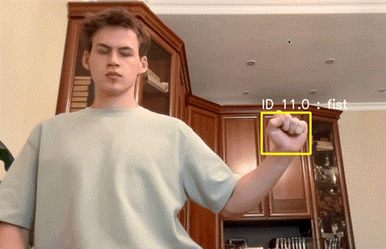
        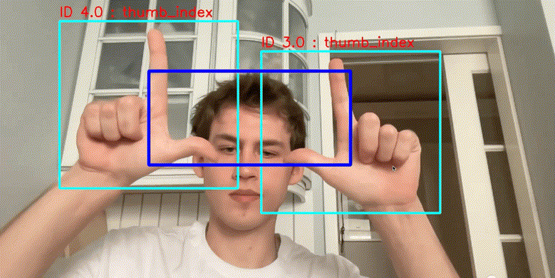
      </div>
      <h4 style="text-align: left;">DRAG AND DROP</h4>
      <div style="text-align: left;">
        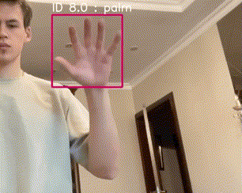
        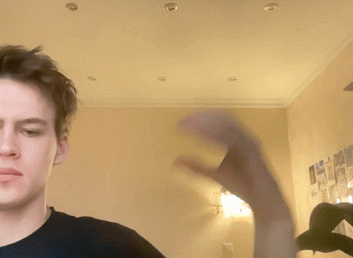
        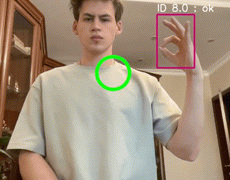
      </div>
    </td>
    <td valign="top" style="padding: 10px; text-align: left; min-height: 600px;">
      <h4 style="text-align: left;">FAST SWIPE UP / DOWN</h4>
      <div style="text-align: left;">
        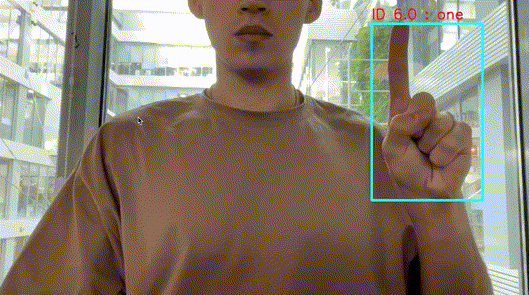
      </div>
      <h4 style="text-align: left;">CLICK</h4>
      <div style="text-align: left;">
        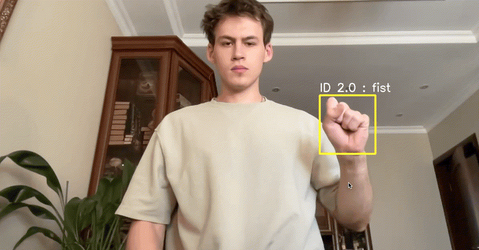
      </div>
      <h4 style="text-align: left;">SWIPES LEFT / RIGHT</h4>
      <div style="text-align: left;">
        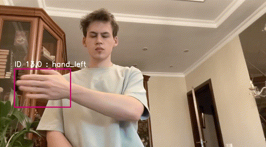
        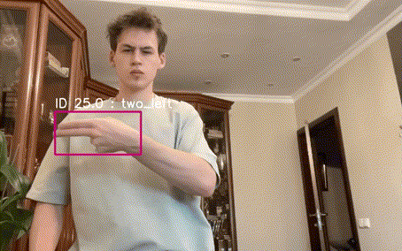
        
      </div>
    </td>
  </tr>
</table>

<h4 style="text-align: left;">SWIPES UP / DOWN</h4>
<div style="text-align: left; min-height: 200px;">
  
  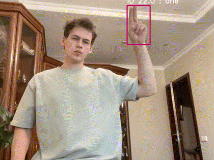
  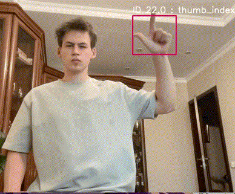
</div>


    
